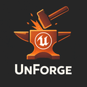

<h1 align="center"><b>SteamSAL — Steam Achievements & Leaderboards for UE5</b></h1>

<p align="center">
  
</p>

<p align="center">
  Blueprint-first, async-driven, tiny API surface.<br/>
  Supports Unreal Engine <b>5.0 → 5.4</b> on <b>Win64</b>.
</p>

## **Table of Contents**
- [**About**](#about)
- [**Features**](#features)
- [**Compatibility**](#compatibility)
- [**Install**](#install)
- [**Enable Steam Online Subsystem (Required)**](#enable-steam-online-subsystem-required)
- [**Quick Start — Leaderboards**](#quick-start-leaderboards)
- [**Quick Start — Achievements & Stats**](#quick-start-achievements--stats)
- [**Blueprint Nodes Overview (Highlights)**](#blueprint-nodes-overview-highlights)
- [**Troubleshooting**](#troubleshooting)
- [**License**](#license)

---

## **About**
**SteamSAL** is a lightweight Unreal Engine 5 plugin that exposes **Steam Leaderboards, Achievements, and Stats** through simple **async Blueprint** nodes—ideal for solo devs and small teams who want the essentials of Steamworks without writing C++.

---

## **Features**
### **Leaderboards**
- 🔎 **Find / Create** leaderboards
- ⬆️ **Upload** scores (Keep Best / Force Update) with optional `Details[]`
- ⬇️ **Download** entries (Global, Friends, Around User, For Users)
- 🧩 **Break** rows → SteamID, Global Rank, Score, Details[], Player Name
- 🧰 Helpers for name, sort, display, and entry count

### **Achievements & Stats**
- 🚀 **Request Current Stats & Achievements** (async) at startup
- 🏆 **Unlock / Clear** achievements; **Indicate Achievement Progress** (toast/progress)
- 📊 **Local (cached) stats**: Set / Add / Batch write → then **Store** to persist
- 🌎 **Global stats**: Request N-day history, aggregate & time-series queries
- 🎛️ UI helpers: **Show Achievements Overlay**, list achievement API names, get display name/icon

---

## **Compatibility**
- **Engine:** UE **5.0 → 5.4**
- **Platform:** **Win64** (others not officially tested)
- **Plugin Type:** **Runtime** (no content)

---

## **Install**
1. **Copy the plugin**
   - Put the `SteamSAL` folder into:
     - `YourProject/Plugins/SteamSAL` *(recommended)*, **or**
     - `Engine/Plugins/Marketplace/SteamSAL`
2. **Enable the plugin**
   - In **Editor → Edit → Plugins**, search **SteamSAL** and enable it. Restart if prompted.
3. **Enable Steam Online Subsystem** — required (see next section).

---

## **Enable Steam Online Subsystem (Required)**
Follow Epic’s official guide (**select your exact UE version** in the doc’s version switcher):  
**▶ Online Subsystem Steam:** https://dev.epicgames.com/documentation/en-us/unreal-engine/online-subsystem-steam-interface-in-unreal-engine

**Minimal `Config/DefaultEngine.ini` (UE 5.0–5.4):**
```ini
; Enable Steam as the default online subsystem
[OnlineSubsystem]
DefaultPlatformService=Steam

[OnlineSubsystemSteam]
bEnabled=true
; Use your own AppID for testing (480 = Spacewar sample)
SteamDevAppId=480

; Use Steam net driver
[/Script/Engine.GameEngine]
+NetDriverDefinitions=(DefName="GameNetDriver",DriverClassName="/Script/OnlineSubsystemSteam.SteamNetDriver",DriverClassNameFallback="/Script/Engine.NetDriver")

[/Script/OnlineSubsystemSteam.SteamNetDriver]
NetConnectionClassName="/Script/OnlineSubsystemSteam.SteamNetConnection"
```

> **Local testing tips**
> - Put `steam_appid.txt` (containing your AppID, e.g. `480`) next to the executable you launch (editor or packaged).  
> - Ensure the **Steam client is running** before starting the game.  
> - **Do not** ship `steam_appid.txt` in releases.

---

## **Quick Start — Leaderboards**
1. Call **`Is Steam Available`** → proceed only if `true`.
2. **`Find Steam Leaderboard`** (or **`Create Steam Leaderboard`**) → cache the **Leaderboard Handle**.
3. **`Upload Steam Leaderboard Score`** → send your score (+ optional `Details[]`).
4. **`Get Steam Leaderboard Entries`** → pick **Global / Friends / Around User / For Users**.
5. For each entry, **`Break SAL_LeaderboardEntryRow`** → `SteamID`, `GlobalRank`, `Score`, `Details[]`, `PlayerName`.

---

## **Quick Start — Achievements & Stats**
> Achievements rely on Steam **stats** under the hood. Read/update stats locally, then **Store** to persist to Steam.

1. **Initialize**
   - Call **`Request Current Stats And Achievements`** (async) on game start; wait for `On Success`.
2. **Unlock an Achievement**
   - Call **`Set Achievement (Unlock)`** with the `Achievement APIName`.
   - Call **`Store User Stats And Achievements`** to persist.
3. **Show Progress (incremental achievements)**
   - Option A: Call **`Indicate Achievement Progress`** with `Current Progress` + `Max Progress` (shows Steam toast).
   - Option B: Update a numeric stat with **`Set Local (Cached) Stat`** or **`Add To Local (Cached) Stat`** (e.g., `ST_JUMPS`), then **`Store User Stats And Achievements`**. Drive unlock logic from your stat thresholds.
4. **UI / Overlay**
   - Call **`Show Achievements Overlay`** to open Steam’s achievements page.

**Common pure helpers you can use right away:**
- `Get Achievement API Names` (list)  
- `Get Achievement Display Name` (localized)  
- `Get Achievement Icon` (texture)  
- `Get Global Achievement Percent`  
- `Get Local (Cached) Stat` / `Get Global Stat (Aggregated)` / `Get Global Stat History`

---

## **Blueprint Nodes Overview (Highlights)**
### **Async**
- **Leaderboards:** `Find Steam Leaderboard`, `Create Steam Leaderboard`, `Upload Steam Leaderboard Score`, `Get Steam Leaderboard Entries`, `Get Steam Leaderboard Entries (Users)`
- **Achievements/Stats:** `Request Current Stats And Achievements`, `Store User Stats And Achievements`, `Request Global Stats`
- **UI:** `Show Achievements Overlay`

### **Pure / Helpers (5+ practical calls)**
- `Is Steam Available`, `Get SteamID`
- `Get Achievement API Names`, `Get Achievement Display Name`, `Get Achievement Icon`, `Get Global Achievement Percent`
- `Get Local (Cached) Stat`, `Get Global Stat (Aggregated)`, `Get Global Stat History`
- `Get Leaderboard Name / Sort Method / Display Type / Entry Count`
- Struct makers: `Make SteamStat`, `Make SAL_StatWrite` (for batch/local writes)

---

## **Troubleshooting**
**`IsSteamAvailable = false`**
- Steam client closed
- `DefaultPlatformService` not set to `Steam`
- Online Subsystem Steam plugin disabled
- `steam_appid.txt` missing or misplaced

**Uploaded but not visible**
- Reuse the same **Leaderboard Handle** when downloading
- Check **Upload Method** (Keep Best vs Force Update)
- Validate via Steam overlay (View → Games → View Game Details)

**Achievements not unlocking**
- Ensure you called **Request Current Stats And Achievements** before writing
- Call **Store User Stats And Achievements** after updates
- Verify the `Achievement APIName` matches your Steamworks configuration

**Friends / Around User empty**
- No prior submissions, privacy, or friend visibility
- Test **Global** first to validate setup

---

## **License**
This project is open source under the **MIT** license. See `LICENSE` for details.

---

<p align="center">
Made with ❤️ by <b>UnForge</b> • If this helped, please ⭐ the repo
</p>
